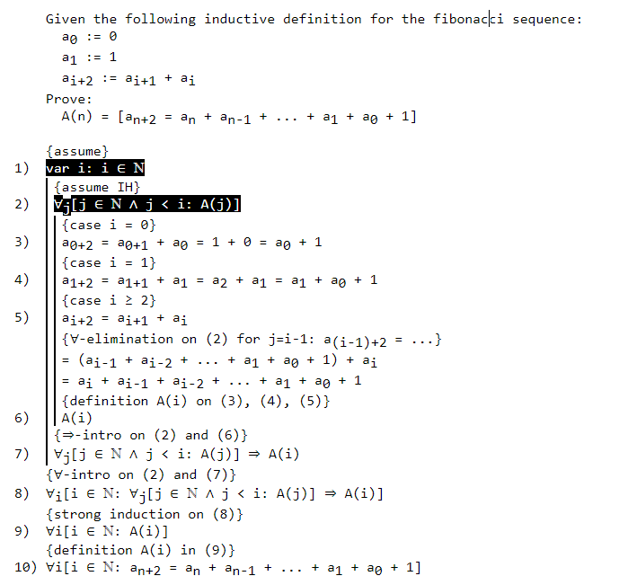

# math-editor

A simple editor that immediately renders the markup text.
This can get a little confusing, since it hides part of the actual text, but it's quite convenient when just making some quick drafts, since it's way faster than using latex.

This project is developed in a big rush (over a time span of ~2 days), since it's needed for personal usage. A lot of the code is scraped together and altered code from another project: [LaunchMenu](https://github.com/LaunchMenu/LaunchMenu).
This project won't be maintained after creation. Instead a proper applet will be made for LaunchMenu in the (far) future. This will have proper maintainable code, and not suffer from all the performance issues that this version has.

It can be used here: https://tarvk.github.io/math-editor/build/

Example:

## Bugs

The editor is quite buggy overall, and computationally very demanding. So be prepared for some serious issues if you plan to use this editor.

## Syntax

The editor has a couple of special constructs:

-   Groups
-   Superscript
-   Subscript
-   Flags
-   Numbering

Apart from that, the editor simply visually replaces 1 character sequence by another. Some syntax highlighting feature is abused to accomplish this.

The `escape` key can be used to toggle between markup and regular rendering.

### Replacements

-   FORALL: ∀
-   EXISTS: ∃
-   SUM: ∑
-   PRODUCT: ∏

-   IN: ∈
-   NOT IN: ∉
-   SUBSET: ⊆
-   STRICTSUBSET: ⊂
-   NOT SUBSET: ⊈
-   NOT STRICTSUBSET: ⊄
-   N: ℕ
-   B: 𝔹
-   Z: ℤ
-   R: R

-   !=: ≠
-   <=: ≤
-   \>=: ≥

-   &&: ∧
-   ||: ∨
-   !: ¬
-   =>: ⇒

-   |: A flag pole, basically also a vertical bar

### Groups

To group a selection of text, you can encapsulate it with double curly braces: `{{ your text}}`
This allows a longer sequence of characters to be used as superscript, subscript or a flag.

### Superscript

To create superscript text, simple use `^`, E.G.: `x^3`. Can be combined with groups: `x^{{this is all superscript}}`.

### Subscript

To create subscript text, simple use `_`, E.G.: `x_3`. Can be combined with groups: `x_{{this is all subscript}}`.

### Flags

To create a flag `|[` can be used, E.G.: `|[var`. Can be combined with groups: `|[{{var i}}`.

These flags are used together with flag poles in a specific proof derivation style.

### Numbering

`TAG` can be added anywhere on a line to prefix it with a line number. The `TAG` text itself will get hidden.
